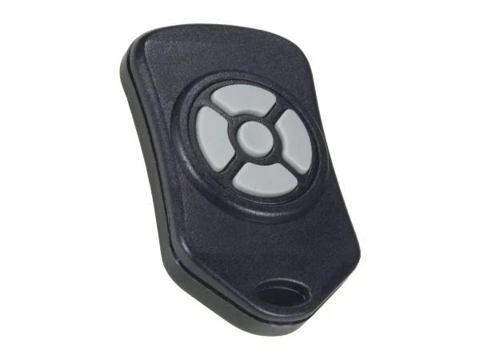

##Linx MS Keyfob Transmitter OTX-XXX-HH-KF (OTX-418-HH-KF5-MS etc.) drive over Arduino Nano
Make easier to use 5-button keyfob in easy way
99 channel selection, use standard 12key matrix keyboard and SSH1106 128x64 OLED display
##Connection - buttons connectings
buttons connecting to GND via transisters, following outputs may be connected to gates on n-ch mosfets or via resistors to n-p-n transistors
Digital output 2 to  	"0" button (SW4) 
Digital output 3 to 	"9" button (SW1)
Digital output 4 to  	"6" button (SW2)
Digital output 5 to  	"3" button (SW3)
Digital output 13 to  PLAY-STOP button (SW5)

  pinMode(10, OUTPUT);  //KBD scan 3 COLS
  pinMode(11, OUTPUT);
  pinMode(12, OUTPUT);

  pinMode(6, INPUT);  // kbd read 4 ROWS
  pinMode(7, INPUT);  //
  pinMode(8, INPUT);  //
  pinMode(9, INPUT);  //
  
 
 
